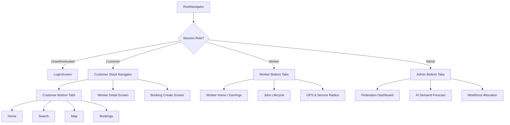

# Sahakari Seva — Mobile Application Architecture

## 1. Executive Summary & Philosophy

The **Sahakari Seva** (सहकारी सेवा) mobile application is a production-grade, native-ready application engineered using **React Native (v0.76.7)** and **Expo SDK 52**. Built specifically for India's cooperative gig economy, the application delivers equal digital sovereignty to gig workers, customers, and cooperative federation administrators.

The mobile architecture adheres strictly to:
- **Zero Paid Maps APIs**: 100% open-source mapping powered by OpenStreetMap (OSM) tile servers and Leaflet rendering.
- **Worker-First Privacy**: Exact worker GPS coordinates are retained on the backend for routing computations, but masked with $\pm 500\text{m}$ approximate area centroids for public map queries.
- **Touch & Accessibility Standards**: All interactive touch targets exceed $48 \times 48\text{ px}$ with tactile feedback, high-contrast labels, and complete bilingual parity (English and Hindi).

---

## 2. Directory Structure

```
mobile/
├── App.tsx                       # Root application entry wrapped in SafeAreaProvider & NavigationContainer
├── index.js                      # Expo registry entry point
├── app.json                      # Expo application manifest, permissions & orientation configuration
├── babel.config.js               # Babel preset configuration
├── tsconfig.json                 # TypeScript strict compilation configuration
├── package.json                  # Dependencies (Expo 52, React Navigation 7, Lucide Icons, i18next)
└── src/
    ├── types.ts                  # Comprehensive TypeScript interfaces for models & states
    ├── i18n/
    │   ├── index.ts              # i18next engine with persistent language storage
    │   ├── en.json               # Full English localization catalog
    │   └── hi.json               # Full Hindi (देवनागरी) localization catalog
    ├── services/
    │   ├── apiClient.ts          # Resilient HTTP client with abort timeouts & fallback caching
    │   └── locationService.ts    # GPS permission lifecycle, coordinate acquisition & zone fallbacks
    ├── components/
    │   ├── common/
    │   │   ├── Header.tsx        # Branded cooperative app bar with language trigger
    │   │   ├── LanguageModal.tsx # Touch-optimized language selector modal
    │   │   └── WorkerCard.tsx    # Card displaying worker stats, trade, distance & match score
    │   └── map/
    │       └── MobileMapView.tsx # OpenStreetMap Leaflet touch map with worker callouts
    ├── navigation/
    │   └── RootNavigator.tsx     # Multi-role Bottom Tabs + Native Stack Navigation
    └── screens/
        ├── auth/
        │   └── LoginScreen.tsx          # Role selection (Customer/Worker/Admin) & OTP authentication
        ├── customer/
        │   ├── HomeScreen.tsx           # Category grid, emergency dispatch CTA, nearby highlights
        │   ├── WorkerSearchScreen.tsx   # Search, filters, radius slider, distance/rating sorting
        │   ├── WorkerMapScreen.tsx      # Fullscreen OpenStreetMap with radius ring & worker pins
        │   ├── WorkerDetailScreen.tsx   # Worker portfolio, cooperative badges, ITI certificates
        │   ├── BookingCreateScreen.tsx  # Dynamic pricing breakdown, address input & booking confirmation
        │   └── CustomerBookingsScreen.tsx # Booking history, lifecycle status & worker contact
        ├── worker/
        │   ├── WorkerHomeScreen.tsx     # Earnings and welfare summary, active tasks, availability toggle
        │   ├── WorkerJobsScreen.tsx     # Job lifecycle manager (Accept -> Start -> Complete)
        │   └── WorkerLocationScreen.tsx # Live GPS status, address resolution & service radius slider
        └── admin/
            ├── AdminDashboardScreen.tsx # Cooperative federation KPI overview & welfare fund status
            ├── AdminForecastScreen.tsx  # 7-day AI demand curves, peak hours & weather surge analysis
            └── AdminAllocationScreen.tsx # Supply-demand zone balancing & 1-tap standby worker mobilization
```

---

## 3. Navigation Hierarchy

The application employs `@react-navigation/bottom-tabs` (v7) and `@react-navigation/native-stack` (v7) in a hierarchical pattern:



---

## 4. UI/UX & Native Mobile Standards

1. **Touch Target Dimensions**: Every interactive button, tab, and card exceeds $48\text{px}$ in height and width.
2. **Safe Area Insets**: Handled comprehensively via `react-native-safe-area-context` to ensure notch, island, and home-indicator protection across iOS and Android.
3. **Optimistic UI Updates**: State updates (e.g., job status transitions, availability toggle, worker mobilization) apply immediately in the UI with background sync.
4. **Color Tokens & Cooperative Brand Identity**:
   - **Cooperative Forest Green**: Primary (`#15803d` / `#16a34a`)
   - **Tricolor Saffron Amber**: Accent & Alerts (`#b45309` / `#d97706`)
   - **Slate Navy**: Headers & Text (`#0f172a` / `#1e293b`)
   - **Clean White / Card Off-White**: Backgrounds (`#ffffff` / `#f8fafc`)

---

## 5. Offline & Network Resilience Strategy

The `ApiClient` (`mobile/src/services/apiClient.ts`) implements:
- **Request Abort Timeouts**: Every network request has an automated 6000ms `AbortController` timeout to prevent hanging UI states.
- **Graceful Fallback Caching**: If the local development or production backend is unreachable, the client falls back to local cached seed structures so that the user never faces a blank screen or unhandled exception.
- **User-Friendly Error Banners**: Network drops are surfaced as subtle non-blocking status badges rather than crash dialogs.
