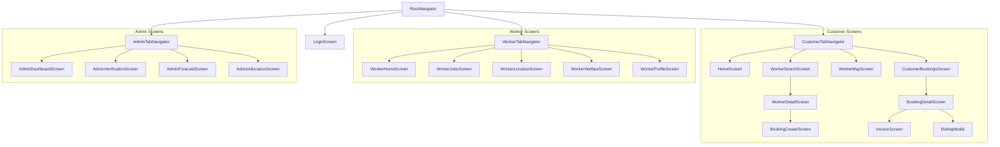

# Sahakari Seva — Comprehensive Screen Audit

**Generated**: September 5, 2026  
**Auditor**: Lead Mobile Architect & Senior Full-Stack Engineer  
**Objective**: Audit every screen across the Mobile App (`mobile/src/screens/`) and Web Application (`src/pages/`), classify each screen with an action tag (`KEEP`, `REDESIGN`, `MERGE`, `MOVE`, `RENAME`, `REMOVE`), provide architectural rationale, define feature migration mappings, and specify exact UI/UX and state requirements.

---

## 1. Screen Audit & Disposition Matrix

| # | Screen Name | Current Location | Action Tag | Target Location | Rationale & Architectural Scope |
|---|-------------|------------------|------------|-----------------|---------------------------------|
| 1 | **Login Screen** | `mobile/src/screens/auth/LoginScreen.tsx` | **ENHANCE** | `mobile/src/screens/auth/LoginScreen.tsx` | Add instant 1-tap role switcher tabs (Customer, Worker, Admin) and pre-filled demo accounts for zero-friction evaluation. Polish UI with cooperative trust theme. |
| 2 | **Customer Home** | `mobile/src/screens/customer/HomeScreen.tsx` | **REDESIGN** | `mobile/src/screens/customer/HomeScreen.tsx` | Integrate hero cooperative banner ("85% goes to workers"), category chips, nearby worker carousel, active job live banner, and quick emergency assistance action. |
| 3 | **Worker Search** | `mobile/src/screens/customer/WorkerSearchScreen.tsx` | **ENHANCE** | `mobile/src/screens/customer/WorkerSearchScreen.tsx` | Add sorting (Distance, Rating, Price), radius filtering (1km to 25km), verified-only toggle, and instant switch to Map view. |
| 4 | **Worker Detail** | `mobile/src/screens/customer/WorkerDetailScreen.tsx` | **ENHANCE** | `mobile/src/screens/customer/WorkerDetailScreen.tsx` | Display verification badge, customer review cards, transparent welfare contribution badge, and fixed sticky "Book Now" CTA. |
| 5 | **Booking Create** | `mobile/src/screens/customer/BookingCreateScreen.tsx` | **ENHANCE** | `mobile/src/screens/customer/BookingCreateScreen.tsx` | Add date/time picker, service location input, and live fair-split calculator (85% worker, 10% welfare, 5% platform) before final confirmation. |
| 6 | **Worker Map** | `mobile/src/screens/customer/WorkerMapScreen.tsx` | **KEEP** | `mobile/src/screens/customer/WorkerMapScreen.tsx` | Zero-cost OpenStreetMap with Leaflet via WebView. Shows customer live GPS and interactive worker markers with bottom sheet previews. |
| 7 | **Customer Bookings** | `mobile/src/screens/customer/CustomerBookingsScreen.tsx` | **ENHANCE** | `mobile/src/screens/customer/CustomerBookingsScreen.tsx` | Segmented control (Active, Completed, Cancelled), status badge pills, card click navigating to `BookingDetailScreen`. |
| 8 | **Booking Detail** | `src/pages/customer/BookingDetailPage.tsx` | **MIGRATE [NEW]** | `mobile/src/screens/customer/BookingDetailScreen.tsx` | Mobile-optimized job tracking stepper (Requested $\rightarrow$ Accepted $\rightarrow$ In Progress $\rightarrow$ Completed $\rightarrow$ Paid), direct phone call action, Pay Now button, View Invoice button, Rate Worker button. |
| 9 | **Invoice / Receipt** | `src/pages/customer/InvoicePage.tsx` | **MIGRATE [NEW]** | `mobile/src/screens/customer/InvoiceScreen.tsx` | Digital invoice showing booking ID, customer/worker details, line items, and detailed cooperative economic distribution (85/10/5). |
| 10 | **Worker Home** | `mobile/src/screens/worker/WorkerHomeScreen.tsx` | **REDESIGN** | `mobile/src/screens/worker/WorkerHomeScreen.tsx` | Modern worker cockpit: Online/Offline duty toggle, Today's Earnings card, Accumulated Welfare credits, Quick incoming job modal/alert. |
| 11 | **Worker Jobs** | `mobile/src/screens/worker/WorkerJobsScreen.tsx` | **ENHANCE** | `mobile/src/screens/worker/WorkerJobsScreen.tsx` | Interactive status transitions (Accept $\rightarrow$ Start $\rightarrow$ Complete), map directions link, customer contact button. |
| 12 | **Worker Location** | `mobile/src/screens/worker/WorkerLocationScreen.tsx` | **KEEP** | `mobile/src/screens/worker/WorkerLocationScreen.tsx` | Live GPS broadcasting toggle, high-accuracy coordinates preview, simulated coordinates updater for testing. |
| 13 | **Worker Welfare** | `src/pages/worker/WorkerEarningsWelfarePage.tsx` | **MIGRATE [NEW]** | `mobile/src/screens/worker/WorkerWelfareScreen.tsx` | Dedicated mobile welfare passbook: Ayushman Bharat health cover, PMSBY accidental insurance, PMJJBY life cover, and retirement provident pool balance. |
| 14 | **Worker Profile** | `src/pages/worker/WorkerProfilePage.tsx` | **MIGRATE [NEW]** | `mobile/src/screens/worker/WorkerProfileScreen.tsx` | Worker digital identity card: photo, trade skills, ITI certificate status, cooperative membership number, language preferences. |
| 15 | **Admin Dashboard** | `mobile/src/screens/admin/AdminDashboardScreen.tsx` | **REDESIGN** | `mobile/src/screens/admin/AdminDashboardScreen.tsx` | Cooperative executive overview: total revenue, worker earnings, welfare pool balance, active workers count, demand surge alerts. |
| 16 | **Admin Verification** | `src/pages/admin/WorkerVerificationPage.tsx` | **MIGRATE [NEW]** | `mobile/src/screens/admin/AdminVerificationScreen.tsx` | KYC & verification approval queue: list of unverified workers (e.g. Arjun Meena), document check, 1-tap Approve/Reject with instant state persistence. |
| 17 | **Admin Forecast** | `mobile/src/screens/admin/AdminForecastScreen.tsx` | **KEEP** | `mobile/src/screens/admin/AdminForecastScreen.tsx` | Scientific ML demand forecasting: historical demand trend, 7-day projection, model accuracy metrics ($R^2$, MAE), category surge indicators. |
| 18 | **Admin Allocation** | `mobile/src/screens/admin/AdminAllocationScreen.tsx` | **KEEP** | `mobile/src/screens/admin/AdminAllocationScreen.tsx` | Predictive workforce reallocation: cluster supply vs demand analysis, deficit warnings, 1-tap workforce shift recommendations. |
| 19 | **Rating Modal** | `src/components/ui/RatingStars.tsx` | **MIGRATE [NEW]** | `mobile/src/components/common/RatingModal.tsx` | Interactive 5-star rating dialog with compliment tags ("Punctual", "Skilled", "Fair Price") and text feedback submission. |
| 20 | **Notifications** | `src/contexts/NotificationContext.tsx` | **MIGRATE [NEW]** | `mobile/src/components/common/NotificationsModal.tsx` | Accessible from header bell across all roles: job alerts, welfare contributions, booking updates. |

---

## 2. Web Screens Retired / Merged

| Web Page | Mobile Disposition | Reason |
|----------|-------------------|--------|
| `src/pages/public/LandingPage.tsx` | **RETIRED** | Replaced by native mobile onboarding and role-specific home screens. Mobile apps do not have marketing landing pages. |
| `src/pages/public/AboutPage.tsx` | **MERGED** | Information integrated into Customer Home cooperative pledge and trust badges. |
| `src/pages/public/WhyCooperativePage.tsx` | **MERGED** | Key facts (85% worker share, 10% welfare, 0% middleman exploitation) embedded across Worker Welfare and Customer Invoice screens. |
| `src/pages/public/ServicesPage.tsx` | **MERGED** | Fully superseded by `mobile/src/screens/customer/HomeScreen.tsx` category grid and `WorkerSearchScreen.tsx`. |
| `src/pages/admin/AdminBookingsPage.tsx` | **MERGED** | Admin dashboard includes live booking count; customer and worker job screens handle workflow states directly. |
| `src/pages/admin/AdminWelfarePage.tsx` | **MERGED** | Aggregated welfare fund displayed on `AdminDashboardScreen.tsx`; individual passbook on `WorkerWelfareScreen.tsx`. |

---

## 3. Screen Hierarchy & Navigation Architecture

---

## 4. Execution Plan for Screen Migration

1. **Step 1**: Implement UI Design System Tokens and Atoms (`mobile/src/theme/`, `mobile/src/components/ui/`).
2. **Step 2**: Create `BookingDetailScreen.tsx` with live action controls (Pay Now demo, Rate Worker, View Invoice).
3. **Step 3**: Create `InvoiceScreen.tsx` displaying the exact 85/10/5 breakdown with cooperative seals.
4. **Step 4**: Create `RatingModal.tsx` and integrate it into the booking flow.
5. **Step 5**: Create `AdminVerificationScreen.tsx` to inspect and approve pending workers.
6. **Step 6**: Create `WorkerWelfareScreen.tsx` with social security passbook.
7. **Step 7**: Create `WorkerProfileScreen.tsx` with skill credentials.
8. **Step 8**: Register all new screens in `RootNavigator.tsx` and verify navigation paths with zero broken links.
